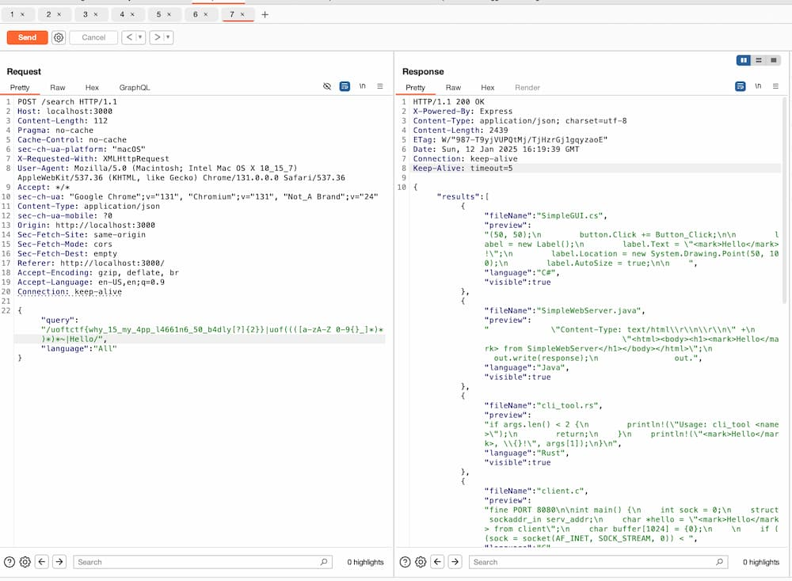

# Code DB (Web, 388 points)

- [x] `My Favorite`

## Problem Overview

This challenge presents a code search engine that lets users search through code by language. The engine supports two search methods: a simple keyword search or a regex search.

When a user enters a search query, the engine searches through a directory containing various source code files and a special file called `flag.txt`. Beforehand, each file in the directory is indexed with a `visible` property. For all files except `flag.txt`, `visible` is set to `true`. For `flag.txt`, the property is set to `false` to keep it hidden from users:


```javascript
    filesIndex[file] = {
      visible: file !== 'flag.txt',
      path: path.join(CODE_SAMPLES_DIR, file),
      name: file,
      language: LANG_MAP[path.extname(file)] || null
    };
```

After running the search, the application filters out results where `visible: false`, which prevents `flag.txt` from appearing in search results:

```javascript
    return preview
      ? {
          fileName,
          preview,
          language: fileData.language,
          visible: fileData.visible
        }
      : null;
  })
  .filter(result => result !== null && result.visible);
```

## Solution

The flag follows the format `uoftctf{...}`. To obtain the flag, we can exploit the regex search feature by causing a ReDoS attack, allowing us to confirm the flag one character at a time.

The search worker imposes a 1-second timeout. If a regex search exceeds that limit, the worker returns an empty result:

```javascript
    const { results } = await runSearchWorker(workerData, 1000);
```

We can exploit this behavior by crafting a regex that selectively triggers ReDoS only when our guess about the flag is incorrect. For example suppose the actual flag is `uoftctf{fake_flag}`. Observe the following two query strings:

1. `uoftctf{fak|uof((([a-zA-Z 0-9{}_]*)*)*)*~|Hello`
2. `uoftctf{fax|uof((([a-zA-Z 0-9{}_]*)*)*)*~|Hello`

- In the first query, `uoftctf{fak` matches right away. Because the engine never tries the overly nested regex portion, no ReDoS occurs, and the response will be the result of the `Hello` search, as the flag is filtered out.
- In the second query, `uoftctf{fax` does not match the flag. The engine will attempt to match `uof((([a-zA-Z 0-9{}_]*)*)*)*~` against the flag, causing a ReDoS if the flag is incorrect. In this case, the response will be empty, as the search worker times out.

By crafting such queries and detecting when a ReDoS occurs, you can verify each character of the flag.  
Repeating this process systematically allows you to brute-force the entire flag.    
Intruder in Burp Suite is a useful tool for automating this process.



## FLAG

`uoftctf{why_15_my_4pp_l4661n6_50_b4dly??}`

## Reference
https://discord.com/channels/1106582098430672958/1328039919473655870
