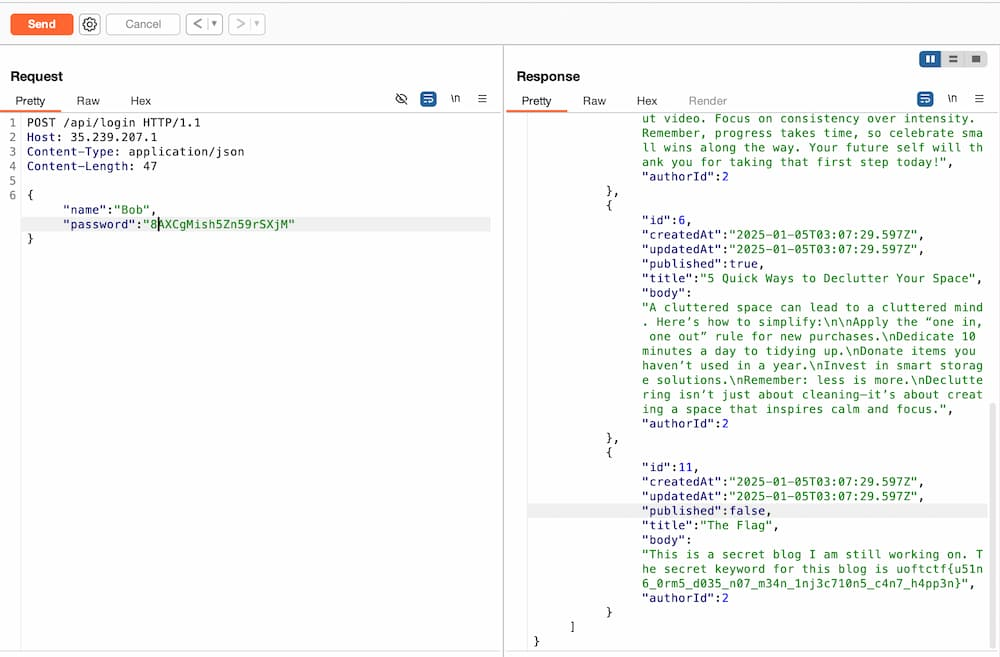

# Prismatic Blogs (Web, 100 points)

- [x] `My Favorite`

## Problem Overview

This challenge presents a **blogging API** built with **Express** and **Prisma**. It exposes two main endpoints:

1. **`GET /api/posts`**  
   - Returns a list of **published** (public) posts.
   - Internally, the server forces any request to include `published = true`, so you **cannot** retrieve unpublished (private) posts directly.

2. **`POST /api/login`**  
   - Authenticates a user by comparing the provided username and password to the database.
   - If the credentials are correct, **all** of that user’s posts (including private ones) are returned in the response.

## The Challenge
A special post—containing the **FLAG**—is marked as **unpublished** (i.e., `published = false`). Because it is unpublished, it never appears in the `GET /api/posts` results. The only way to see it is to be authenticated as the user who authored it.

When you call `POST /api/login`, you must provide the **exact** password. If correct, you receive that user’s posts—even the private ones. However, the problem is that each user’s password is **random** and **not easily guessable** by ordinary means (e.g., it’s 15–24 random alphanumeric characters).

### The Solution

In the `GET /api/posts` endpoint, it takes a query parameter from the request and uses it to filter the posts.

```javascript
      let query = req.query;
      query.published = true;
      let posts = await prisma.post.findMany({where: query});
```

The idea is to **exploit** prisma query and add conditions that queries the user’s password.   
If you send a request to `GET /api/posts?author[password][lt]=xxx`, the server will return all posts where the author’s password is **less than** `xxx` in lexicographical order.   
(You can also use `[lte]`, `[gt]`, `[gte]`, `[equals]`, `[startsWith]`, `[endsWith]`, etc. Note that you cannot use `[startsWith]` because it is not case-sensitive for sqlite.)
By using this filter, you can **leak** the user’s password character by character.

Refer [solver.ts](./solution/solver.ts) for the complete solution.

Then you'll get the password of the users as below:

| User  | Password                 |
|-------|--------------------------|
| White | `3pCtWJfabwPlo6qNgGS1P4` |
| Bob   | `8AXCgMish5Zn59rSXjM`    |
| Tommy | `OZuSyfPSxlwZuipoyWETQ9` |
| Sam   | `AIIr7DxG3EarBQu`        |

Then all you have to do is login with those passwords and get the flag.

## FLAG



`uoftctf{u51n6_0rm5_d035_n07_m34n_1nj3c710n5_c4n7_h4pp3n}`
